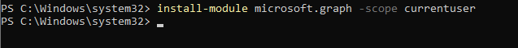
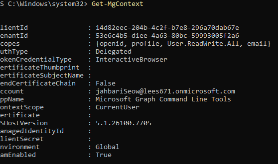
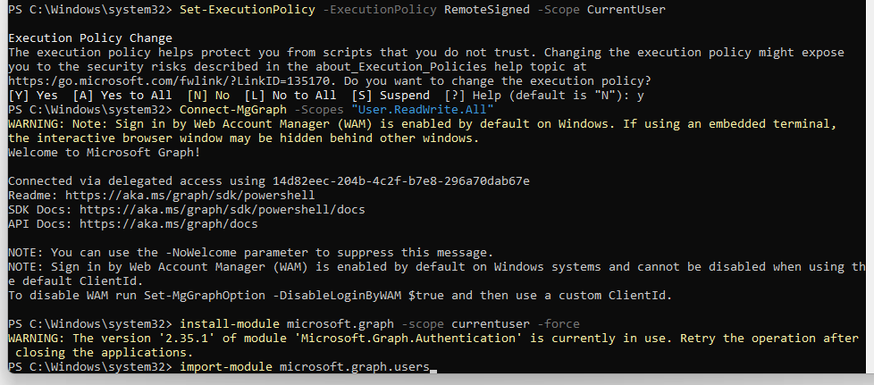
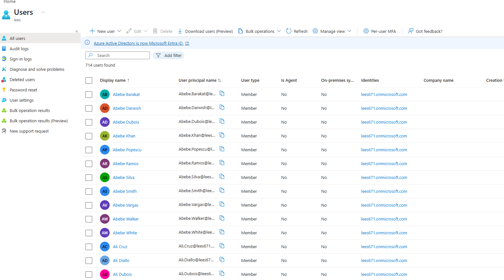

# Microsoft Entra ID – Bulk User Provisioning Automation Lab

This lab demonstrates hands-on skills in **identity automation**, **Microsoft Entra ID administration**, and **PowerShell scripting** using the **Microsoft Graph SDK**.

The lab simulates an enterprise identity scenario where **hundreds or thousands of users** must be provisioned efficiently and securely, without manual portal-based user creation.

---

## Lab Overview

- Automated bulk user provisioning in **Microsoft Entra ID**
- Used **PowerShell** with the **Microsoft Graph SDK**
- Authenticated using **delegated Microsoft Graph permissions**
- Handled execution policy restrictions and module dependencies
- Validated results through Entra ID and script output

**Business Problem Solved:**  
- Eliminates manual, error-prone user creation  
- Enables scalable onboarding during company growth or mergers  
- Ensures consistent identity configuration  
- Aligns with modern IAM automation and least-privilege practices  

---

## PowerShell & Microsoft Graph Setup

- Installed the **Microsoft Graph PowerShell SDK**
- Configured PowerShell execution policy at the **current user scope**
- Imported required Graph modules for user management

  
*Installing the Microsoft Graph PowerShell SDK.*

---

## Authentication & Tenant Context

- Connected to Microsoft Graph using delegated permissions
- Requested `User.ReadWrite.All` scope for user provisioning
- Verified authentication and tenant context

  
*Successful connection to Microsoft Graph showing tenant ID.*

  
*Validated authenticated account, tenant, and permission scopes.*

---

## Bulk User Provisioning Automation

- Executed PowerShell automation to provision **1,000+ users**
- Created users programmatically instead of manual portal entry
- Displayed real-time creation output during script execution

  
*PowerShell script actively provisioning users.*

## Validation & Results

- Verified newly created users in the **Microsoft Entra ID portal**
- Exported provisioning results to a CSV file for auditing
- Confirmed successful and repeatable automation

  
*Provisioned users visible in the Entra ID portal.*

  
*CSV output file capturing provisioning results.*

---

## Platforms & Technologies Used

Microsoft Entra ID, PowerShell, Microsoft Graph SDK, Microsoft Graph API, Identity & Access Management (IAM), Automation, CSV Reporting, GitHub

---

## Summary

This lab demonstrates **enterprise-scale identity automation**, including:

- Secure Microsoft Graph authentication
- PowerShell-based bulk user provisioning
- Duplicate handling and error resilience
- Validation and audit-friendly output

The project reflects real-world identity automation performed by **IAM engineers, cloud engineers, and security teams**.
